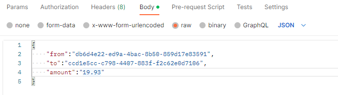

# Money Transfer API

This is a Go-based RESTful API that emulates money transfers between accounts.

## Instructions

1. Clone the repository:

2. Build and run the application using the following command: go run cmd/main.go

3. The API server will start running on `http://localhost:8080`.

## API Endpoints

### List Accounts

Returns the list of all accounts.

- **URL**: `/accounts`
- **Method**: GET
- **Response**: JSON array containing the accounts data.

### Transfer Money

Transfers money from one account to another.

- **URL**: `/transfer`
- **Method**: POST
- **Request raw / json**: JSON object containing the following fields:
- `from`: ID of the account to transfer money from.
- `to`: ID of the account to transfer money to.
- `amount`: Amount to transfer (in string format).

example : 

## Design Choices

- The accounts data is stored in an in-memory data structure and is not persisted between restarts.
- Concurrency is handled using a `sync.RWMutex` to ensure safe access to shared data.
- The API endpoints are implemented using the standard `net/http` package in Go.
- JSON is used as the data interchange format for requests and responses.
- The transfer amount is represented as a string to maintain precision for financial calculations.

Please note that this is a simplified implementation and may require further enhancements for production use.

Feel free to contact me if you have any questions or need further assistance. 

Email : laithnuman2018@gmail.com
Phone : 00962797319028